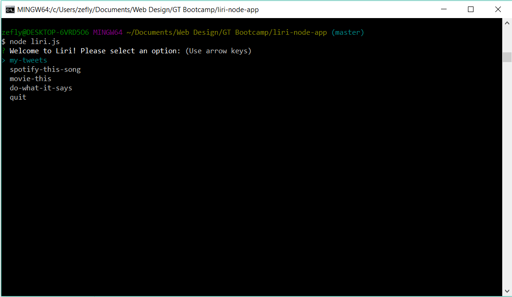
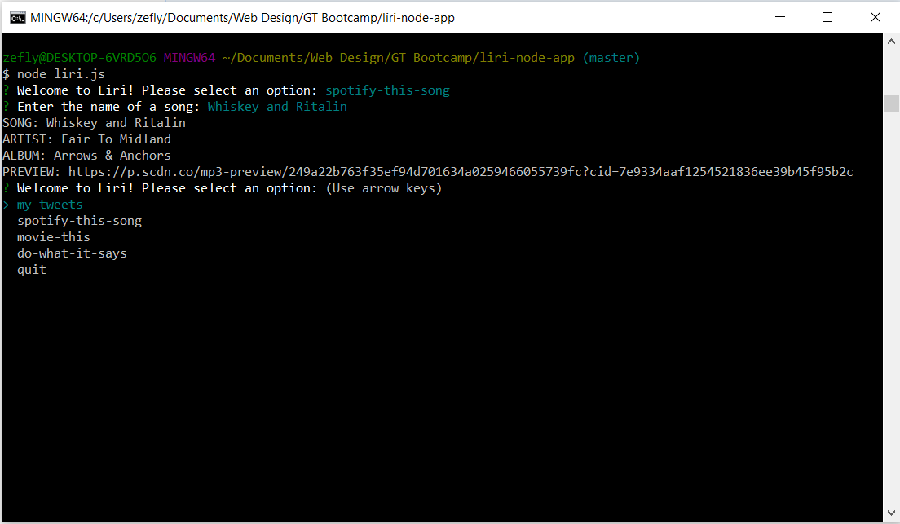
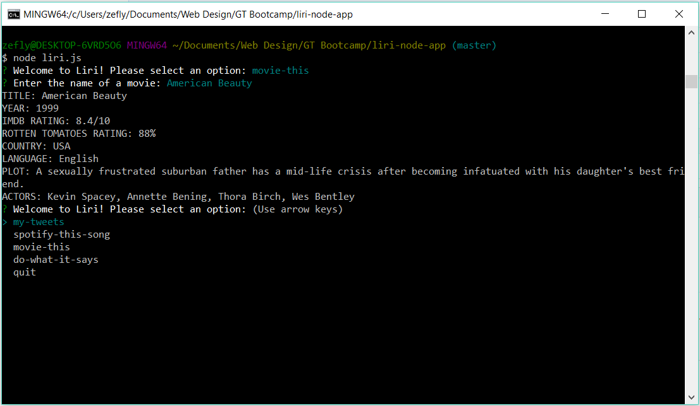
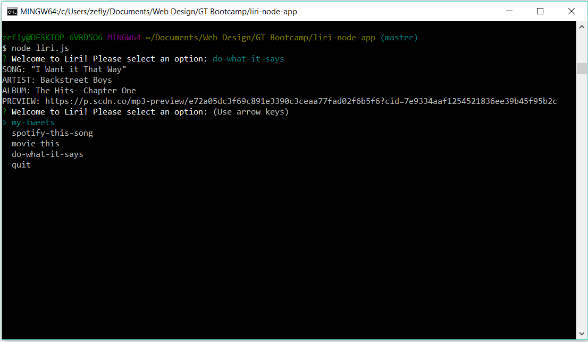
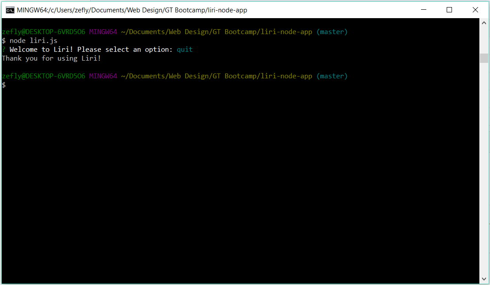

# liri-node-app
Utilizing Node.js to build a Command line data fetch project for Georgia Tech Coding Bootcamp.

## liri home

I used inquirer to build a menu selection screen for Liri's functions

## liri tweets

Liri's tweet function returns tweets

## liri spotify

Liri's spotify function returns data for the song searched for

## liri movie

Liri's movie function returns data for the movie searched for

## liri do-what-it-says

Liri's do-what-it-says function grabs a search query from a text file and returns data for it

## liri quit

Liri's quit allows you to exit the program.

